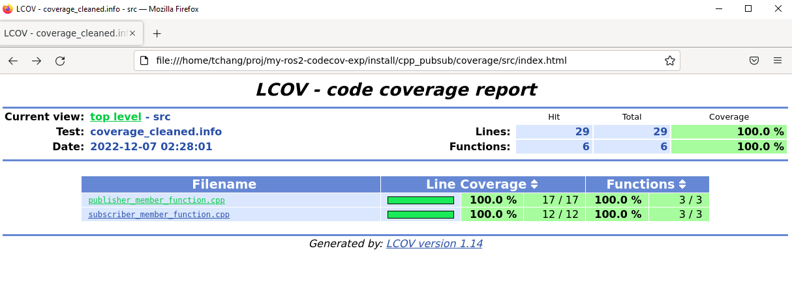

# my-ros2-codecov-exp

## How to build for test coverage

```
colcon build --cmake-args -DCOVERAGE=1 --packages-select cpp_pubsub
cat log/latest_build/cpp_pubsub/stdout_stderr.log
```

## How to check c++ code (and others) for style and static coding errors

```
colcon test --packages-select cpp_pubsub
cat log/latest_test/cpp_pubsub/stdout_stderr.log
```

You should see:

```
100% tests passed, 0 tests failed out of 6

Label Time Summary:
cppcheck      =   0.20 sec*proc (1 test)
flake8        =   0.29 sec*proc (1 test)
lint_cmake    =   0.18 sec*proc (1 test)
linter        =   2.57 sec*proc (6 tests)
pep257        =   0.25 sec*proc (1 test)
uncrustify    =   0.19 sec*proc (1 test)
xmllint       =   1.46 sec*proc (1 test)
```

## How to run test and generate code coverage report
```
## don't forget to source the shell environment
source install/setup.bash

# launch unit test to generate coverage. Or terminate the run after 3 seconds
timeout 3 ros2 launch cpp_pubsub run_test.launch.py

# create coverage report (both lcov info file and html output)
ros2 run cpp_pubsub generate_coverage_report.bash
```

You should see:
```
Summary coverage rate:
  lines......: 100.0% (29 of 29 lines)
  functions..: 100.0% (6 of 6 functions)
  branches...: no data found
Reading data file /home/tchang/proj/my-ros2-codecov-exp/install/cpp_pubsub/lib/cpp_pubsub/coverage_cleaned.info
Found 2 entries.
Found common filename prefix "/home/tchang/proj/my-ros2-codecov-exp/cpp_pubsub"
Writing .css and .png files.
Generating output.
Processing file src/publisher_member_function.cpp
Processing file src/subscriber_member_function.cpp
Writing directory view page.
Overall coverage rate:
  lines......: 100.0% (29 of 29 lines)
  functions..: 100.0% (6 of 6 functions)
Code Coverage generated:
     /home/tchang/proj/my-ros2-codecov-exp/install/cpp_pubsub/lib/cpp_pubsub/coverage_cleaned.info
     /home/tchang/proj/my-ros2-codecov-exp/install/cpp_pubsub/coverage/index.html
```


